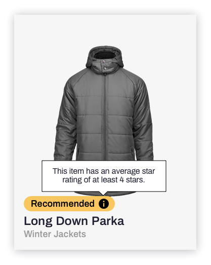

# Assignment: Badge with Tooltip



## Getting started
This project is pre-configured to get you started quickly; running
```
npm install
npm run dev
```
should open a browser on http://localhost:8080 that shows a playground.

## TODOs
- Add tooltip styling and center it on the tooltip button
- Add tooltip hover and tap functionality
- Add tap 10 second expiration functionality
- Styling fixes: icon color (currentColor fill), elipsis text wrap
- Polish styling
- Browser compatibility and other requirements (if any)

## Instructions
- please fork this repository and do regular commit's so Crobox can see your thinking / development progress.
- the assignment is to implement a Badge with a tooltip; See the image as example.
- this badge is configurable, and the props are already passed in.
- the provided `preact` and `goober` libraries should be used to create this component.
- the file that contains the badge implementation is [here](src/badge/index.js).
- the icon can be found in the `public/img` folder and is allowed to be embedded directly.
- if you are finished, stuck or it takes you more than 4 hours please let your contact at Crobox know.

## Configurable props
- badge text content
- badge text color
- badge background color
- tooltip text content

## Intended behavior
- hover/tap on icon activates tooltip
- badge appears using opacity fade-in

## Requirements
- icon only visible when tooltip text is available
- the icon background color must follow badge text color
- badge width should scale with content (with a max width of the parent).
- when content exceeds badge width, ellipsis (…) should be applied.
- tooltip width should scale with content (with a max width of 240px)
- when the tooltip is tapped, it should disappear again after 10 seconds
- the assignment should work on all modern browsers (including mobile) and gracefully on IE11
- project should compile on Linux

